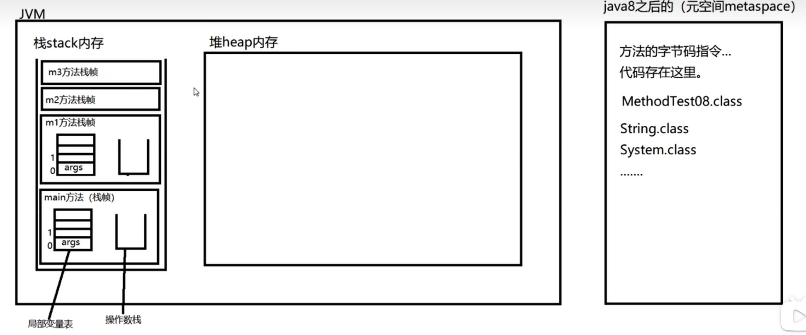
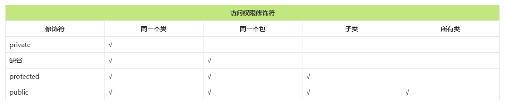
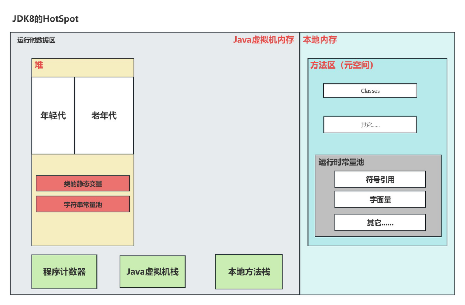

# Java 笔记01
# 今日目标： 190 集 需要补充62原视频
## 第一章 Java开发环境搭建 1-20
## 第二章 Java 基础语法 21-110
### 2.1 标识符
### 2.2 关键字
### 2.3 字面量
### 2.4 变量
### 2.5 二进制和编码
### 2.6 数据类型
#### 2.6.1 从键盘输入 50集 
  - nextInt(),nextDouble(),next()...末尾自动加/r(回车)
### 2.7 运算符
-  51集 自加字节码解读
  - 查看字节码命令 javap -c 文件名.class
  - 阅读字节码
    - bipush   10
    >将10压入操作数栈
    - istore_1
    >将操作数栈栈顶弹出，并将其赋值给1号槽位
    - iload_1 (赋值操作)
    >将1号槽位的数值复制一份，并压入操作数栈
    - iinc  x , y
    >x号槽位数值加y
- 52集 自加操作经典面试
  - iload就是赋值操作，当变量在=右边就执行iload
- 59集 按位与运用
  - 判断奇数
    >和数字1进行按位与 //逻辑与两边操作类型为布尔
- 60集 按位或运用
  - 将某数某一位保证为1
    >a | (1<<2)  //保证a第二位为1
- 61集 按位异或运用
  - 加密解密
    >加密password = data ^ key
    >解密num = password ^ key
- 62集 取反操作（~）
  - 某一位清零
    >a & (~(1<<3))   //按位与和取反配合
- 63集 扩展赋值运算符
  - 自动强制转化类型（+=，-=，*=.....）  
### 2.8 控制语句
### 2.9 方法

  
- 96集  **方法执行内存图**
  - 
- 103集 package命令
  - 带包编译
    >javac -d 编译后包的存放目录 文件.java
  - 在同一个包下的类可以调用，不同的包需要导入
## 第三章 面向对象 111
### 3.1 对象的创建和使用
#### 对象的创建
``` java
Student s = new Student();
```
在Java中，使用class定义的类，属于引用数据类型。所以student属于引用数据类型。类型名为：student表示定义一个变量。数据类型是studento变量名是s。

#### 对象的使用
读取属性值：s.name
修改属性值：s.name = "jackson"

#### 通过一个类可以实例化多个对象
Student sl = new Student();
Student s2 = new Student();
### 3.2 封装
#### 封装目的
  提供安全性，代码复用
#### 封装步骤
  属性私有化
  提供公开的访问入口  
### 3.3 构造方法
#### 构造方法有什么作用？
构造方法的执行分为两个阶段：对象的创建和对象的初始化。这两个阶段不能颠倒，也不可分割。
在Java中，当我们使用关键字new时，就会在内存中创建一个新的对象，虽然对象已经被创建出来了，但还没有被初始化。而初始化则是在执行构造方法体时进行的。
#### 构造方法如何定义？
[修饰符列表]构造方法名（形参）{}
#### 构造方法如何调用？
new构造方法名（实参），
#### 关于无参数构造方法
如果一个类没有显示的定义任何构造方法，系统会默认提供一个无参数构造方法，也被称为缺省构造器。
 **显示的定义了构造方法，则缺省构造器将不存在。为了方便对象的创建，建议将缺省构造器显示的定义出来。**

#### 关于构造代码块。对象的创建和初始化过程梳理：
>new的时候在堆内存中开辟空间，给所有属性赋默认值
执行构造代码块进行初始化
执行构造方法体进行初始化
构造方法执行结束，对象初始化完毕。
### 3.4 this 关键字
1. this出现在实例方法中，代表当前对象。语法是：this.
2. this本质上是一个引用，该引用保存当前对象的内存地址。
3. 通过"this”可以访问实例变量，可以调用实例方法。
4. this存储在：栈帧的局部变量表的第0个槽位上。
5. this大部分情况下可以省略，用于区分局部变量和实例变量时不能省略。
6. this不能出现在静态方法中
7. **"this（实参）”语法：**
> 只能出现在构造方法的第一行。
 通过当前构造方法去调用本类中其他的构造方法。
 作用是：代码复用。
 - 举例子：
 ``` java
public People() {
        this(5,"zhangsan");
    }

public People(int age, String name) {
        this.age = age;
        this.name = name;
    }
```
### 3.5 static 关键字
1. static是一个关键字，翻译为：静态的。
2. static修饰的变量叫做静态变量。当所有对象的某个属性的值是相同的，建议将该属性定义为静态变量，来节省内存的开销。
3. 静态变量在类加载时初始化，存储在堆中。
4. static修饰的方法叫做静态方法。
所有静态变量和静态方法，统一使用“类名”调用。虽然可以使用“引用”来调用，但实际运行时和对象无关，所以不建议这样写，因为这样写会给其他人造成疑惑。
5. 使用“引用，”访问静态相关的，即使引用为null，也不会出现空指针异常。
6. 静态方法中不能使用this关键字。因此无法直接访问实例变量和调用实例方法。
7. 静态代码块代表了类加载时刻，如果你有代码需要在此时刻执行，可以将该代码放到静态代码块中。
- 举例子：
``` java
static {
   System.out.println("此时类加载完成");
}
```
8. 静态代码块在类加载时执行，一个类中可以编写多个静态代码块，遵循自上而下的顺序依次执行。
### 3.6 单例模式
只允许创建一个对象
#### 单例模式步骤
  >构造方法私有化
  >提供公开的静态方法，获取对象
  >提供一个静态变量，保存单例
- 示例代码：
``` java
public class People {
    //提供一个静态变量，保存单例
    privite static People s = new People();
    //构造方法私有化
    privite People{ }
    //提供公开的静态方法，获取对象
    public static People getpeople{
        return s;
    }
}
```
### 3.7 继承
1. 继承作用？
   - 基本作用：代码复用
   - 重要作用：有了继承，才有了方法覆盖和多态机制。
2. Java只支持单继承，一个类只能直接继承一个类。
3. Java不支持多继承，但支持多重继承（多层继承）。
4. 子类继承父类后，除私有的不支持继承、构造方法不支持继承。其它的全部会继承。
5. 一个类没有显示继承任何类时，默认继承java lang.0bject类。
### 3.8 方法覆盖
#### 什么情况下考虑使用方法覆盖？
- 当从父类中继承过来的方法无法满足当前子类的业务需求时。

#### 发生方法覆盖的条件？
1. 具有继承关系的父子类之间
2. 相同的返回值类型，相同的方法名，相同的形式参数列表
3. 子类访问权限不能变低，可以变高。
4. **子类抛出异常不能变多，可以变少**。
5. 返回值类型可以是父类方法返回值类型的子类。

#### 方法覆盖的小细节：
1. 注解标注的方法会在编译阶段检查该方法是否重写了父类的方法。
2. 私有方法不能继承，所以不能覆盖。
3. **构造方法不能继承，所以不能覆盖。**
4. 静态方法不存在方法覆盖，方法覆盖针对的是实例方法。
5. 方法覆盖说的实例方法，和实例变量无关。
### 3.9 多态
####多态的基础语法
什么是向上转型和向下转型？
>java允许具有继承关系的父子类型之间的类型转换。
>向上转型(upcasting)：子一>父
>子类型的对象可以赋值给一个父类型的引用。


>向下转型(downcasting)：父一>子
>父类型的引用可以转换为子类型的引用。但是需要加强制类型转换符。

无论是向上转型还是向下转型，前提条件是：两种类型之间必须存在继承关系。这样编译器才能编译通过。

#### 什么是多态？
父类型引用指向子类对象。
``` java
Animal a = new cat();
a.move();
```
程序分为编译阶段和运行阶段：
>编译阶段：编译器只知道a是Animal类型，因此去Animal类中找move（）方法，找到之后，绑定成功，编译通过。这个过程通常被称为静态绑定。

>运行阶段：运行时和JVM堆内存中的真实Java对象有关，所以运行时会自动调用真实对象的m。ve0方法。这个过程通常被称为动态绑定。

多态指的是：多种形态，编译阶段一种形态，运行阶段另一种形态，因此叫做多态。
### 3.10 super 关键字 160-166
1. super关键字和this关键字对比来学习。this代表的是当前对象。super代表的是当前对象中的父类型特征。
2. super不能使用在静态上下文中。super是针对对象的
3. this可以单独输出，super不能单独输出。this为引用，单独输出时自动调toString()方法
4. "super.”大部分情况下是可以省略的。什么时候不能省略？
当父类和子类中定义了相同的属性（**实例变量**）或者相同方法（**实例方法**）时，如果需要在子类中访问父类的属性或方法时，super.不能省略。
5. super（实参）；通过子类的构造方法调用父类的构造方法，目的是为了完成父类型特征的初始化。
6. 当一个构造方法第一行没有显示的调用"super（实参），也没有显示的调用"this（实参）”，系统会自动调用super（）。因此一个类中的无参数构造方法建议显示的定义出来。
7. super（实参）；这个语法只能出现在构造方法第一行。
8. 在Java语言中只要new对象，0bject的无参数构造方法一定会执行。
### 3.11 final 关键字
fina|修饰的类不能被继承
fina|修饰的方法不能被覆盖
fina|修饰的变量，一旦赋值不能重新赋值 
fina|修饰的引用，一旦指向某个对象后，不能再指向其它对象。但指向的对象内部的数据是可以修改的。
fina|修饰的实例变量必须在对象初始化时手动赋值
fina|修饰的实例变量一般和static联合使用：称为常量
### 3.12 抽象类
#### 什么时候考虑将类定义为抽象类？
如果类中有些方法无法实现或者没有意义，可以将方法定义为抽象方法。类定义为抽象类。这样在抽象类中只提供公共代码，具体的实现强行交给子类去做。比如一个Person类有一个问候的方法greet()，但是不同国家的人问候的方式不同，因此greet()方法具体实现应该交给子类。
#### 抽象类如何定义？
 abstract class 类名{}

抽象类有构造方法，但无法实例化。抽象类的构造方法是给子类使用的。
#### 抽象方法如何定义？
abstract 方法返回值类型 方法名（形参）；

**1. 抽象类中不一定有抽象方法，但如果有抽象方法那么类要求必须是抽象类。
2.一个非抽象的类继承抽象类，要求必须将抽象方法进行实现/重写。
3.abstract关键字不能和private,fina|，static关键字共存。**
### 3.13 接口
#### 接口的作用
面向接口调用的称为：接口调用者
面向接口实现的称为：接口实现者
调用者和实现者通过接口达到了解耦合。也就是说调用者不需要关心具体的实现者，实现者也不需要关心具体的调用者，
双方都遵循规范，面向接口进行开发。
面向抽象编程，面向接口编程，可以降低程序的耦合度，提高程序的扩展力。
>例如定义一个Usb接口，提供read()和write()方法，通过read（）方法读，通过write()方法写：
定义一个电脑类computer，它是调用者，面向Usb接口来调用。
Usb接口的实现可以有很多，例如：打印机(Printer)，硬盘〈HardDrive)。
``` java
public class computer{
  public void connect(Usb usb){
    usb.read();
    usb.write();
  }
}
```
#### 接囗与抽象类如何选择
抽象类和接口虽然在代码角度都能达到同样的效果，但适用场景不同：
**抽象类主要适用于公共代码的提取**。当多个类中有共同的属性和方法时，为了达到代码的复用，建议为这几个类提取出来一个父类，在该父类中编写公共的代码。如果有一些方法无法在该类中实现，可以延迟到子类中实现。这样的类就应该使用抽象类
**接口主要用于功能的扩展**。例如有很多类，一些类需要这个方法，另外一些类不需要这个方法时，可以将该方法定义到接口中。需要这个方法的类就去实现这个接口，不需要这个方法的就可以不实现这个接口接口主要规定的是行为。
### 3.14 类之间的关系
1. 泛化关系（is a）
2. 实现关系（is like a）
3. 关联关系（has a）
4. 聚合关系
聚合关系指的是一个类包含、合成或者拥有另一个类的实例，而这个实例是可以独立存在的。聚合关系是一种弱关联关系，表示整体与部分之间的关系。例如一个教室有多个学生
5. 组合关系（Composition）
组合关系是聚合关系的一种特殊情况，表示整体与部分之间的关系更加强烈。组合关系指的是一个类包含、合成或者拥有另一个类的实例，而这个实例只能同时存在于一个整体对象中。如果整体对象被销毁，那么部分对象也会被销毁。例如一个人对应四个肢体。
6. 依赖关系（Dependency）
依赖关系是一种临时性的关系，当一个类使用另一个类的功能时，就会产生依赖关系。如果一个类的改变会影响到另一个类的功能，那么这两个类之间就存在依赖关系。依赖关系是一种较弱的关系，可以存在多个依赖于同一个类的对象。例如A类中使用了B类，但是B类作为A类的方法参数或者局部变量等。

### 3.15 Object类
1. java.lang.Object是所有类的超类。java中所有类都实现了这个类中的方法。
2. Object类是我们学习JDK类库的第一个类。通过这个类的学习要求掌握会查阅API帮助文档。
3. 现阶段Object类中需要掌握的方法：
   - toString：将java对象转换成字符串。
   - equals：判断两个对象是否相等。
4. 现阶段Object类中需要了解的方法：
   - hashCode：返回一个对象的哈希值，通常作为在哈希表中查找该对 象的键值。Object类的默认实现是根据对象的内存地址生成一个哈希码（即将对象的内存地址转换为整数作为哈希值）。hashCode()方法是为了HashMap、Hashtable、HashSet等集合类进行优化而设置的，以便更快地查找和存储对象。
   - finalize：当java对象被回收时，由GC自动调用被回收对象的finalize方法，通常在该方法中完成销毁前的准备。
   - clone：对象的拷贝。（浅拷贝，深拷贝）
     >protected修饰的只能在同一个包下或者子类中访问。
     >只有实现了Cloneable接口的对象才能被克隆。

### 3.16 访问控制权限

### 3.17 内部类
**什么是内部类？**
定义在一个类中的类。
**什么时候使用内部类？**
- 一个类用到了另外一个类，而这两个类的联系比较密切，但是如果把这两个类定义为独立的类，不但增加了类的数量，也不利于代码的阅读和维护。
- 内部类可以访问外部类的私有成员，这样可以将相关的类和接口隐藏在外部类的内部，从而提高封装性。
- 匿名内部类是指没有名字的内部类，通常用于定义一个只使用一次的类，比如在事件处理中。

**内部类包括哪几种？**
- 静态内部类：和静态变量一个级别
静态内部类如何实例化：OuterClass.StaticInnerClass staticInnerClass = new OuterClass.StaticInnerClass();
无法直接访问外部类中实例变量和实例方法。
- 实例内部类：和实例变量一个级别
实例内部类如何实例化：OuterClass.InnerClass innerClass = new OuterClass().new InnerClass();
可以直接访问外部类中所有的实例变量，实例方法，静态变量，静态方法。
- 局部内部类：和局部变量一个级别
局部内部类方外类外部的局部变量时，局部变量需要被final修饰。
从JDK8开始，不需要手动添加final了，但JVM会自动添加。
- 匿名内部类：特殊的局部内部类，没有名字，只能用一次。

### 3.18 JVM内部结构


